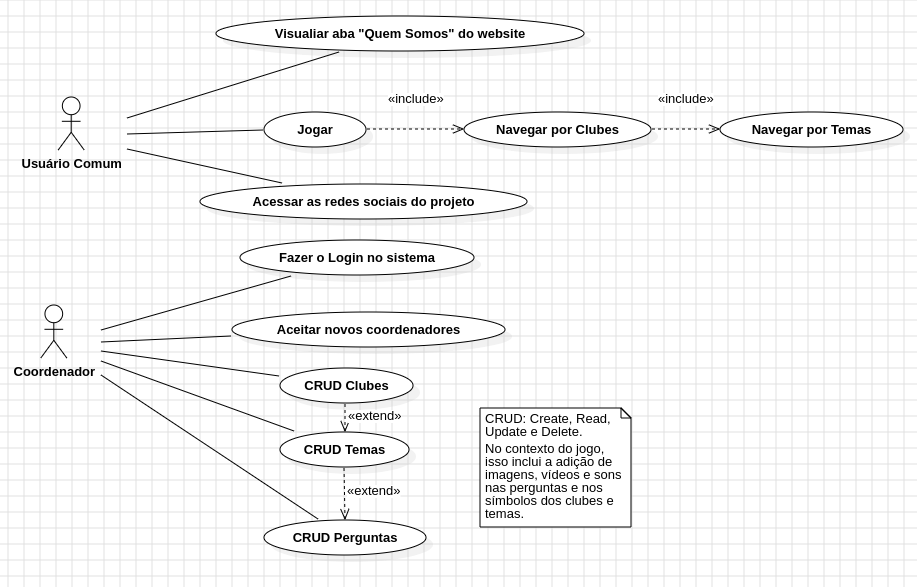

# Projeto Pontinha

*Lucas Greff Meneses - 13671615*
*Yuri Fernandes Pereira - 13730127*

 

*Universidade de São Paulo* 
*Instituto de Ciências Matemáticas e de Computação*

## Plano de Projeto
[Plano de Projeto](https://drive.google.com/drive/folders/1Kp4l4wmGyN-o173UJA1Z_BRWZ9riUMh0?usp=sharing)

## Protótipos de Alta Fidelidade
Protótipos desenvolvidos no WireframePro.

[Quem somos, Fale Conosco](https://wireframepro.mockflow.com/view/MDN5mCYJPh#/page/6fe92076b04a4d8597cca1188d6d06a9)

[Login, Cadastro, Menu Jogo](https://wireframepro.mockflow.com/view/M81pvm6ovqb#/page/D0ab6cdc25eacf7f633366f5c2090e823)

[Escolher Clube e Tema, Perguntas](https://wireframepro.mockflow.com/view/MUXZETQ8uqb#/page/057e01fda35b468ab5153320973d3bc7)

[Coordenação, Gerenciar Clubes](https://wireframepro.mockflow.com/view/Mb9wHGxKPh#/page/454a03018329409d94c0916848932e17)

[Gerenciar Temas e Perguntas Parte 1](https://wireframepro.mockflow.com/view/M4jMmA84vqb#/page/1e395dc03ace4fbaad452f7876784f43)

[Gerenciar Temas e Perguntas Parte 2](https://wireframepro.mockflow.com/view/MIDSsV35vqb#/page/b773fe78fb2a4da28c1ff00aa9182505)

## Casos de Uso
Diagrama de casos de uso temporário (não sei se está 100% certo kkkk)

## Cenários de teste

**1. Acesso às Perguntas**

  **Descrição**: Verificar se os usuários podem acessar as perguntas disponíveis no website e jogá-las.

  **Passos**:

  1. Abrir o website.
  2. Clicar na aba "Jogo".
  3. Clicar no botão "Jogar".
  4. Selecionar um clube (por exemplo: inglês, meio ambiente, dança).
  5. Selecionar um tema (por exemplo: animais, comidas, cores).
  6. Veriricar se as perguntas estão listadas corretamente (por exemplo: a pergunta de inglês sobre cores está no clube "inglês" e no tema "cores" e não em outro lugar).
  7. Acertar uma pergunta e verificar o indicativo de acerto.
  8. Errar uma pergunta e verificar o indicativo de erro.

 **Critérios de Aceitação**: As perguntas devem ser acessíveis e estar organizadas por categoria, além dos indicativos de erro e acerto estarem corretos.

**2. CRUD de Clubes, Temas e Perguntas pelo Coordenador**

  **Descrição**: Verificar se os coordenadores podem fazer o CRUD de perguntas, clubes e temas para o jogo.

  **Passos**:

  1. Fazer login com sucesso como coordenador.
  2. Acessar a listagem de clubes.
  3. Incluir um novo clube com nome e imagem.
  4. Alterar um clube existente.
  5. Excluir um clube existente.
  6. Acessar um clube existente.
  7. Incluir um novo tema com nome e imagem.
  8. Alterar um tema existente.
  9. Excluir um tema existente.
  10. Acessar um tema existente.
  11. Incluir uma nova pergunta com a possibilidade de incluir texto, imagem, video e som, além das alternativas de resposta.
  12. Alterar todas as características de uma pergunta existente (texto, imagem, vídeo, som e alternatias).
  13. Excluir uma pergunta existente.

 **Critérios de Aceitação**: É possível realizar o CRUD dos clubes, temas e perguntas, com atualizações no banco de dados.
